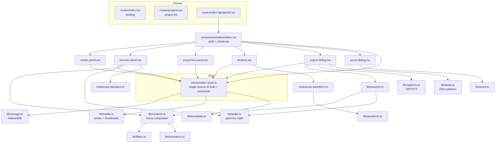
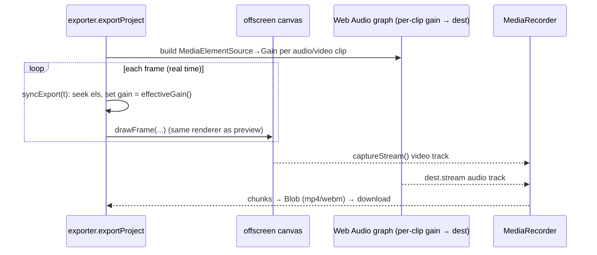

# Irie Cut — Code Graph & Architecture

A navigation map for humans and AI agents. It shows **how the pieces connect**, the
**core data flows**, and **what every file does**. If you're about to change something,
find it here first.

- **Stack:** React 19 · TanStack Router (file-based) · zustand · Tailwind v4 · Vite 8 · Canvas 2D · Web Audio
- **Shape:** a pure client-side SPA (`apps/web`). No backend, no network calls, at all.
- **One rule to remember:** the **canvas renderer (`lib/renderer.ts`) is shared by the live preview and the exporter**, so anything you draw shows up in both. Same for **audio gain (`lib/audio.ts`)**.

---

## Module graph (who depends on whom)



---

## Core data flows

### 1) Rendering a frame (preview)
```mermaid
sequenceDiagram
  participant Store as editor-store (project, currentTime)
  participant PV as preview-panel (rAF loop)
  participant Sync as syncMedia (hidden video/audio els)
  participant RND as renderer.drawFrame
  participant Canvas
  PV->>Store: read project + currentTime + isPlaying
  PV->>Sync: seek/play each clip's media element; set el.volume = effectiveGain()
  PV->>RND: drawFrame(ctx, project, time, sources)
  RND->>Canvas: bg → video/image (transform+transition+filter) → text on top
```
`hooks/use-playback.ts` advances `currentTime` in real time while playing.

### 2) Exporting an MP4


### 3) State, persistence & undo/redo
- Every edit goes through `mutate()` in the store: it pushes the previous project onto `past`, applies the change, clears `future`, and **debounce-saves** to IndexedDB.
- A `coalesceKey` collapses rapid mutations (drag/slider/typing) into a single undo step.
- `undo()` / `redo()` swap snapshots between `past` ⇄ `project` ⇄ `future`.

---

## Annotated file map

### Root
| Path | Role |
| --- | --- |
| `bunfig.toml`, `.prototools`, `.moon/` | Toolchain pinning (bun/moon via proto). |

### `apps/web/src/types`
| File | Role |
| --- | --- |
| `editor.ts` | **Domain types** — `Project` (incl. optional workflow intent), `Track`, `Clip` (incl. `transform`, `speed`, `filter`, `quality`, `role`, `transitionIn/Out`), `TextProperties`, defaults. Start here to understand the data model. |

### `apps/web/src/stores`
| File | Role |
| --- | --- |
| `editor-store.ts` | **The single source of truth.** Holds the loaded project, media, selection, playhead, zoom, undo/redo history. All mutations + persistence live here (`mutate`, `undo`, `addClipFromMedia`, `splitAtPlayhead`, `updateTrack`, `addCaptions`, `applyTemplate`, …). Exports `createProject` and `projectDuration`. |

### `apps/web/src/lib` — pure logic (no React)
| File | Role |
| --- | --- |
| `renderer.ts` | **Canvas compositor.** `drawFrame()` paints one frame: background → video/image (with transform, transition, filter) → text. Shared by preview + export. |
| `exporter.ts` | Real-time MP4 export: offscreen canvas + `captureStream` + Web Audio mixing + `MediaRecorder`. |
| `audio.ts` | Mixing math: `effectiveGain()` (clip × track × master × mute/solo × fade), `anySolo()`. Shared by preview + export. |
| `transitions.ts` | Per-clip in/out transitions; `transitionModifier()` returns alpha/translate/scale/clip. |
| `filters.ts` | Color-grade presets (CSS `filter` strings) + `filterCss()`. |
| `quality.ts` | Lightweight per-clip enhance/denoise helpers composed into the shared canvas filter chain. |
| `storage.ts` | IndexedDB wrapper (projects, media metadata, media blobs). |
| `media.ts` | Probe uploaded files (duration/dimensions), generate thumbnails, time formatting. |
| `waveform.ts` | Decode audio → cached normalized peak buckets. |
| `captions.ts` | Build `.srt` / `.vtt` from text clips. |
| `caption-words.ts` | Attach word-level timing to caption cues as clip-local karaoke words. |
| `caption-styles.ts` | Reusable caption track style presets. |
| `beats.ts` | Story-beat roles + `buildEdl()` / `buildCutdown()` / `beatSummary()`. |
| `score.ts` | `scoreProject()` — creative score + deterministic export-readiness checks, including workflow-aware YouTube music-video checks. |
| `templates.ts` | Format templates (ratio + starter layout specs, plus optional workflow/project defaults). |
| `beat-cut.ts` | Beat-cut planner: given detected beat times and a set of media sources, decides cut points and builds the resulting clips. Pure, deterministic, media-agnostic. |
| `beat-detect.ts` | Energy-novelty beat detection from decoded audio. |
| `motion.ts` | Ken-Burns motion presets applied as keyframes. |
| `chroma.ts` | WebGL chroma key (green screen) pass. |
| `blend.ts` | Blend-mode compositing. |
| `mask.ts` | Reveal masks (rect/ellipse/linear, feather, invert). |
| `keyframes.ts` | Linear-interpolation keyframe animation on clip transform properties. |
| `exporter-webcodecs.ts` | Frame-accurate export via `VideoEncoder`/`AudioEncoder` + mp4 muxing. |
| `brand-kit.ts` | A small localStorage-backed brand palette + font, applied to text in one click. |
| `utils.ts` | `cn()` class helper. |

### `apps/web/src/hooks`
| File | Role |
| --- | --- |
| `use-playback.ts` | rAF clock that advances `currentTime` while playing; stops at the end. |
| `use-waveform.ts` | Loads a clip's audio blob and returns cached waveform peaks. |
| `use-mobile.ts` | Viewport helper (from scaffold). |

### `apps/web/src/components/editor`
| File | Role |
| --- | --- |
| `editor.tsx` | **Shell.** Loads the project, mounts playback, global keyboard shortcuts (space, S split, M marker, ⌘Z undo/redo, arrows), lays out the resizable panels, header (undo/redo, score, export). |
| `media-panel.tsx` | Left panel tabs: Media (import + assets), Text, Stickers, Layouts. |
| `preview-panel.tsx` | Center canvas + transport + master volume; owns the render/sync loop and hidden media elements. |
| `properties-panel.tsx` | Right panel: selected-clip props (timing, role, volume, speed, filter, transform, transitions, text) or project settings. |
| `timeline.tsx` | The timeline: toolbar, ruler + markers, track-header gutter (mute/solo/lock/volume/reorder), clips (drag/trim/snap, filmstrip thumbnails, waveforms, role badges). |
| `export-dialog.tsx` | Export modal: readiness summary, MP4 render, caption (.srt/.vtt), edit-plan (EDL/cutdown), and post-kit downloads. |
| `score-dialog.tsx` | Creative scorecard modal + header score badge. |
| `project-menu.tsx` | Inline-editable project title. |

### `apps/web/src/components/ui`
shadcn / base-ui primitives (button, dialog, slider, select, tabs, …). Generated; rarely edited by hand.

### `apps/web/src/routes`
| File | Role |
| --- | --- |
| `__root.tsx` | Root layout + providers (TooltipProvider, Outlet). |
| `index.tsx` | Marketing landing page. |
| `projects.tsx` | Project list / create / delete (IndexedDB) and project bundle import/export. |
| `editor.$projectId.tsx` | Editor route; wraps `<Editor>` in `ClientOnly`. |
| `routeTree.gen.ts` | **Generated** by the TanStack Router plugin — do not edit. |

---

## Where to add things (extension points)

| You want to… | Touch these |
| --- | --- |
| Add a clip property | `types/editor.ts` (the field) → `editor-store.ts` (mutation) → `properties-panel.tsx` (UI) → `renderer.ts`/`exporter.ts` if it affects pixels/audio |
| Add a visual effect | `filters.ts` or `transitions.ts` → it renders in preview + export automatically (shared renderer) |
| Add a timeline tool | `timeline.tsx` (toolbar/clip interaction) + a store action |
| Add an export/producer artifact | a `lib/*.ts` builder + a button in `export-dialog.tsx` |
| Change scoring | `lib/score.ts` (`scoreProject`) |

## Invariants worth keeping
- **Preview == export:** route any new pixel/audio behavior through `renderer.ts` / `audio.ts` so both stay in sync.
- **All edits go through `mutate()`** so undo/redo and persistence keep working; pass a `coalesceKey` for high-frequency updates.
- **Client-only, zero network:** the editor must run with no network calls at all. Keep browser-only APIs out of SSR (editor routes are wrapped in `ClientOnly`).
